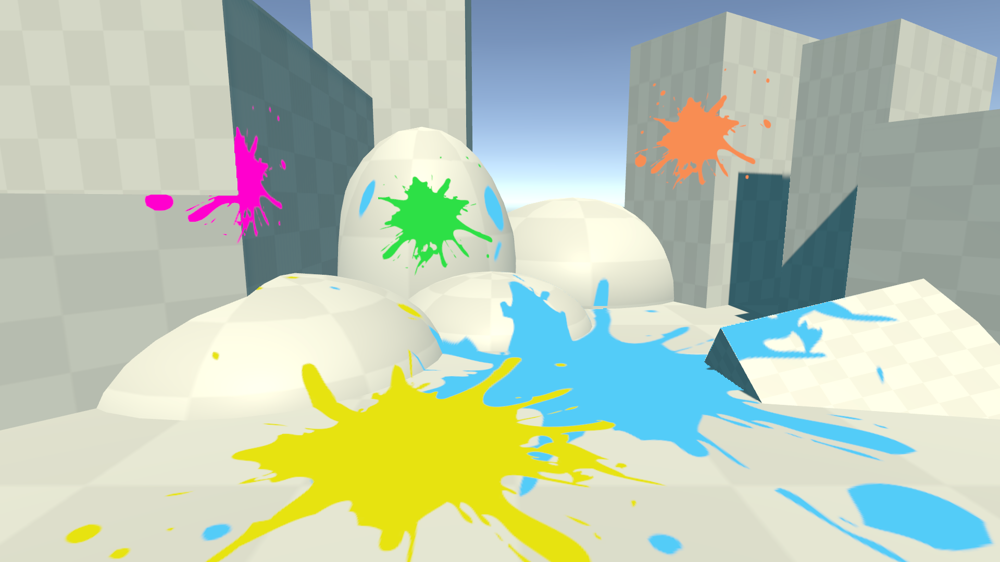

# ScreenSpaceDecal

## What is it

My simple implementation of screen space decal shader in Unity.

It does not support lighting or shadow receiving.

This was mainly a study project, where I wanted to force myself to learn a bit more about the different spatial transforms that can be performed in shaders.

## Features

- Screen space decal implementation.
- Color filter for the decal.
- Angle threshold to cut off streaks (user adjustable.)
- I left verbose comments to the code in case someone wants to study how screen space decals can be implemented.
- Developed on Unity 2018.4.12f1.
